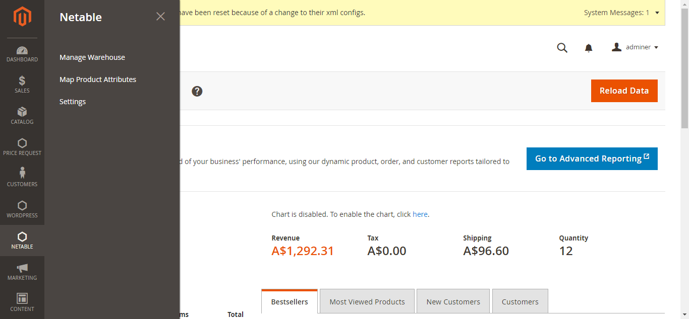
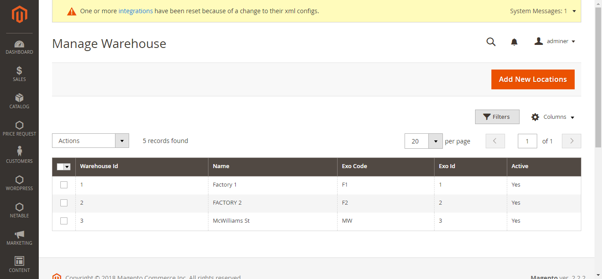
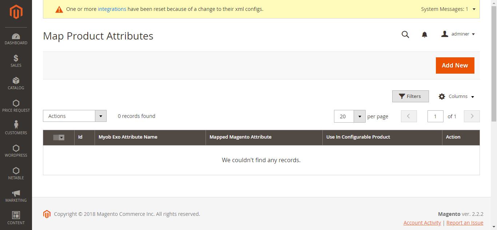
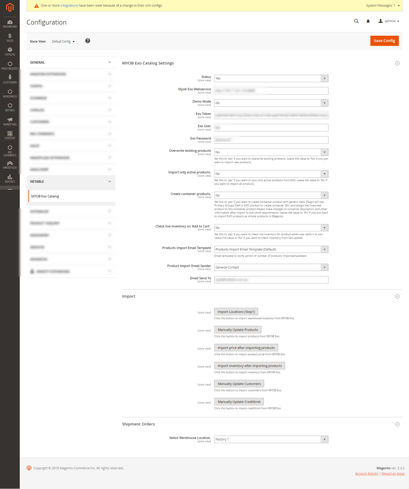

## MYOB EXO Magento2 Integration.
ERP Systems to help you see the bigger picture

## Extension Features
  - Import different products types from MYOB EXO to Magento2
  - Import customers from MYOB EXO to Magento2
  - Export customers to MYOB EXO to Magento2
  - Export Sales order to MYOB EXO to Magento2
  - Map products to different warehouse locations

## Contact us
To get this extension please contact us info@netable.com.au

## Screenshots
### Menu Items

### Manage Warehouse

### Map Product attributes to EXO

### Configure Your EXO

